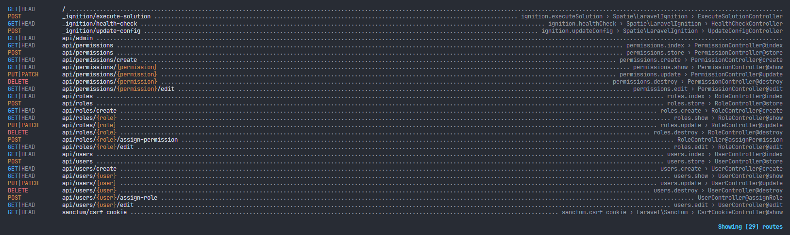

# UMS-RBAC-API

UMS with RBAC (User Management System with Role-Based Access Control) API built with Laravel 10.

## Installation

1. Download the code by clicking **Code**, **Download ZIP**. Or if you have Git install in your machine, you can run this in your terminal.

```
git clone https://github.com/devmuhammadzaki/UMS-RBAC-API.git
```

2. Change directory to your local copy of `UMS-RBAC-API` in your terminal. Then install composer dependencies.

```
composer install
```

3. Copy `.env` file from `.env.example`. In NIX machine you can use this command.

```
cp .env.example .env
```

4. Prepare a database. You can use this command.

```
mysql -uroot -e "CREATE DATABASE UMS-RBAC-API_db"
```

If you have password for your database, you need to specify `-p` on the command.

5. Configure your database settings in `.env`

```
DB_CONNECTION=mysql
DB_HOST=127.0.0.1
DB_PORT=3306
DB_DATABASE=UMS-RBAC-API_db
DB_USERNAME=root
DB_PASSWORD=
```

6. Migrate database tables and seed them with fake data

```
php artisan migrate
```

7. Generate a key for you application

```
php artisan key:generate
```

8. Run the development server

```
php artisan serve
```

# Routes (Endpoints)

```
php artisan route:list
```



# Tests

```
php artisan test
```


